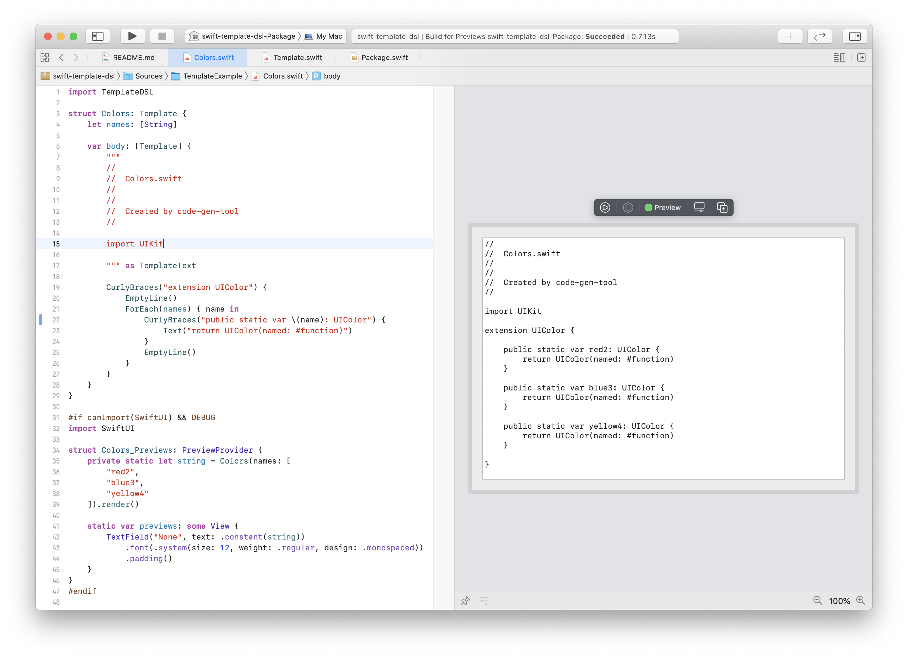

# Swift TemplateDSL

[](https://swift.org/package-manager)
[](https://github.com/Alexander-Ignition/CombineCoreData/blob/master/LICENSE)

Swift template engine

TemplateDSL will help you
- code generation
- html pages
- any complex strings



## Instalation

Add dependency to `Package.swift`...

```swift
.package(url: "https://github.com/Alexander-Ignition/swift-template-dsl", from: "0.0.1"),
```

... and your target

```swift
.target(name: "ExampleApp", dependencies: [
    .product(name: "TemplateDSL", package: "swift-template-dsl")
]),
```

## Usage

Two simple steps:

1. write yout Template.

```swift
import TemplateDSL

struct Page: Template {
    let items = Array(0..<3)

    var body: [Template] {
        Text("Header")
        ForEach(items) { item in
            Indent {
                Text("- item: \(item)")
            }
        }
        Text("Footer")
    }
}
```

2. render Template.

```swift
let page = Page()
let string = page.render()
print(string)
/*
Header
    - item: 0
    - item: 1
    - item: 2
Footer
*/
```

## Preview

You can use the SwiftUI preview to quickly view the templates.

See the more complex example in [Sources/TemplateExample/Colors.swift](Sources/TemplateExample/Colors.swift)

```swift
#if canImport(SwiftUI) && DEBUG
import SwiftUI

struct Page_Previews: PreviewProvider {
    private static let string = Page().render()
    
    static var previews: some View {
        TextField("None", text: .constant(string)).padding()
    }
}
#endif
```
